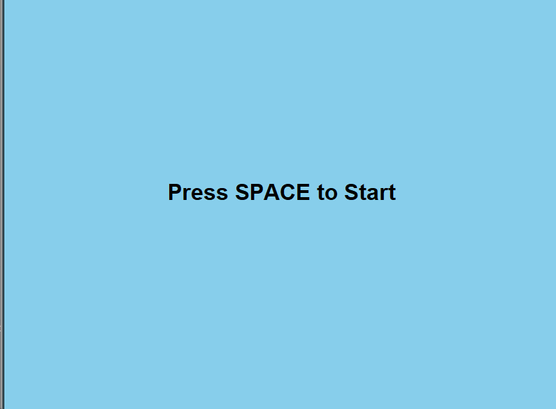
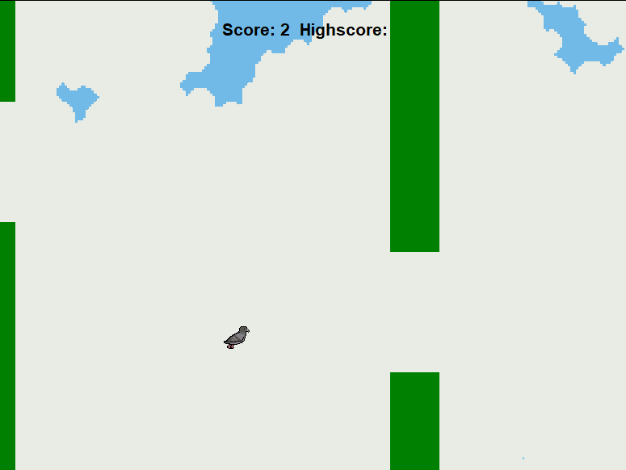
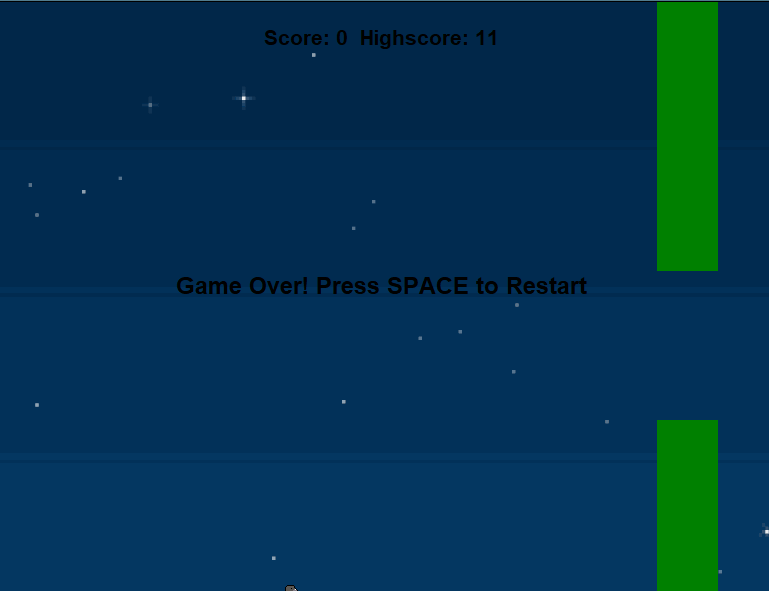

# Bird Flap Game 

A classic **Flappy Bird-style game** made with **Python** and **Turtle Graphics**, using object-oriented programming and sprite assets. The player controls a bird that flaps through randomly generated pipes, avoiding obstacles and trying to achieve the highest possible score.

Built during my second year of university as an object-oriented Python exercise with visual and interactive gameplay.

---

##  Gameplay Overview

- The bird is affected by **gravity**, and you must **flap** (via `SPACE` or `LEFT CLICK`) to keep it airborne.
- Pipes are generated at intervals with randomized gaps that the bird must fly through.
- The background randomly switches between different sky themes on each run.
- Your **score increases over time** as you survive. A **high score** is saved between sessions.
- You can restart the game at any time after failing.

---

## 🕹 Controls

| Input        | Action               |
|--------------|----------------------|
| `SPACE`      | Flap upward          |
|` Left Click`   | Flap upward          |

---

## Features

- Object-Oriented Design with clean modular code
- Turtle-based sprite rendering using `.gif` assets
- Background asset rotation on each session
- Bird and pipe hitbox collision detection
- Score + high score tracking (stored in `highscore.txt`)
- Support for both **keyboard and mouse controls**
- Clean restart behavior and game-over screen

---

##  Gameplay

| Menu Screen                          | In-Game                             | Game Over                         |
|-------------------------------------|-------------------------------------|-----------------------------------|
|     | | |


---

##  Visual Assets

All visual assets belong to the following creators and are used under their respective standard free licenses (for personal use):

-  [ Free Game Assets - Nature Landscapes Free Pixel Art](https://craftpix.net/file-licenses/)  
-  [ kangjung - Pigeon Pixel](https://kangjung.itch.io/pigeon-pixel)  

##  Tech Stack

- **Language**: Python 3.x
- **Graphics**: Turtle Graphics
- **Assets**: `.gif` sprites for bird, background, and pipes
- **Platform**: Cross-platform (Windows recommended for consistency)
- **No external dependencies required**

---

##  Getting Started

###   Prerequisites

- Python 3.8 or higher
- Turtle module (comes with standard Python)

###  Installation

```bash
git clone https://github.com/cosminelul/bird-jump.git
cd bird-jump
python main.py
